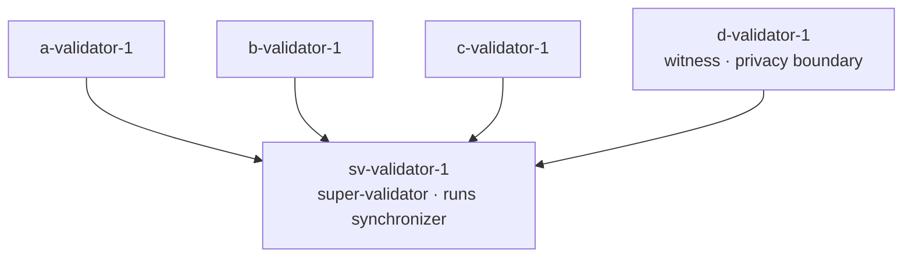

<!-- Copyright (c) 2026 Peaceful Studio OÜ -->
<!-- SPDX-License-Identifier: Apache-2.0 -->

# Topologies

## Why topology matters

The same stack scales from a single super-validator to a five-participant
network, and you pick the shape per test. A privacy-boundary check needs a
dedicated witness participant; a fast unit-adjacent integration run needs only
one or two validators; a full end-to-end suite wants every slot up. Rather than
maintain a separate environment for each of these, canton-localnet exposes one
declarative topology you resize on demand — boot the super-validator alone, add
validators up to the full five, and layer on observability, a Participant Query
Store, or a second synchronizer when a scenario calls for it.

## The role model

A topology is exactly **one SV** (super-validator, which runs the synchronizer
infrastructure — sequencer, mediator, and scan) plus **N general validators**.
The SV is non-toggleable: every topology has exactly one, force-injected on
boot. The stack ships **five named slots** — the SV plus four general-purpose
validator slots — each with a per-slot enable flag, so you boot only the
validators a scenario needs.

- **Minimum boot:** `sv-validator-1` alone (N = 0, all other slots disabled).
- **Default:** all five slots on (N = 4, the full topology).

Slot `d` is the reserved **witness** slot. A witness is a validator whose hosted
parties exist to assert privacy boundaries in tests — party W on the witness
validator must *not* observe transactions between parties on the other
validators. Witness-ness is a usage pattern, not a separate role or a different
configuration shape; the slot is a normal validator held aside for that purpose.

| Slot             | Port prefix | JSON Ledger API | Role                                            |
| ---------------- | ----------- | --------------- | ----------------------------------------------- |
| `sv-validator-1` | `10`        | `10975`         | super-validator — runs the synchronizer, always on |
| `a-validator-1`  | `11`        | `11975`         | general validator                               |
| `b-validator-1`  | `12`        | `12975`         | general validator                               |
| `c-validator-1`  | `13`        | `13975`         | general validator                               |
| `d-validator-1`  | `14`        | `14975`         | witness — reserved for privacy-boundary tests   |

Every host-exposed port is `<prefix><suffix>`: suffix `975` is the JSON Ledger
API, `901` the participant gRPC ledger, `902` the participant admin gRPC, and
`903` the Splice validator admin. So `a-validator-1`'s JSON Ledger API is
`11975` and its gRPC ledger is `11901`.

## Topology diagram

## Optional layers

Three optional layers stack on top of the validator topology. All three are
**off** in the repo's shipped configuration — `make up`, a bare
`canton-localnet up` from this repo, and CI all start without them, because the
repo-root `canton-localnet.yaml` pins `modules.obs` and `modules.pqs` to `false`
to keep the CI runner within its memory budget. (The CLI's built-in fallback,
used only when no `canton-localnet.yaml` is found in any ancestor directory,
enables observability and PQS; the shipped root config deliberately overrides
that.)

### Observability

Adds the Grafana / Prometheus / Loki / Tempo / cAdvisor stack, with Grafana
served on `localhost:3030`. **Off** in the repo's shipped config, under
`make up`, and in CI (on only in the no-config fallback). Toggle it with
`modules.obs` in
`canton-localnet.yaml`, or force-enable it for a single run with the `--obs`
flag on `canton-localnet up`.

### Participant Query Store (PQS)

Adds a queryable projection of the ledger. **Off** in the repo's shipped config,
under `make up`, and in CI (on only in the no-config fallback). It is brought up
for `a-validator-1`, and additionally for `c-validator-1` when that slot is
enabled.
Toggle it with `modules.pqs` in `canton-localnet.yaml`, or force-enable it for a
single run with the `--pqs` flag.

### Multi-synchronizer

Brings up a second synchronizer (`app-synchronizer`) and connects the `a`, `b`,
and `d` validators to it, enabling cross-domain scenarios such as reassignment.
The bootstrap also enables the multi-synchronizer topology feature flag on those
three participants, on **every** synchronizer each is connected to at bootstrap,
and waits for it to take effect before the `multi-sync-startup` container exits.
`make up` blocks on that container completing, so a consumer driving an
unassign/assign flow does not need its own step to turn the flag on. A
synchronizer a participant connects to *later* is not covered — the flag is
applied once, over the connections present at bootstrap.
Default: **off**. Enable it with `multiSync: true` in `canton-localnet.yaml` or
the `--multi-sync` flag. This profile is for local and CI use only — do not
enable it on the shared VM.

## Resource sizing

The `canton` and `splice` services each run a single JVM hosting **all** enabled
validator slots' participants and validator apps, so heap demand scales with the
number of enabled slots. The shipped caps in
`compose/modules/localnet/resource-constraints.yaml` are sized for the default
five-slot topology:

| Topology              | canton `-Xmx` / `mem_limit` | splice `-Xmx` / `mem_limit` |
|-----------------------|-----------------------------|-----------------------------|
| 1 validator (sv only) | 1.5g / 2.5g                 | 1g / 1.5g                   |
| 3 validators (sv+a+b) | 2.5g / 3.5g                 | 2g / 2.5g                   |
| 5 validators (default)| 4g / 5g                     | 3g / 4g                     |

For host allocation, the figures below are **estimates** — they have not been
empirically validated post-resize:

| Topology                            | Recommended | Headroom-for-dev |
|-------------------------------------|-------------|------------------|
| 3-validator                         | 8 GiB       | 12 GiB (room for builds)              |
| 5-validator + observability         | 16 GiB      | 24 GiB (room for `make build` + tests) |

Idle steady-state working set for the full five-validator stack with PQS and
observability sits around 6.5 GiB; anything tighter than 16 GiB leaves zero
headroom for Daml compilation or test runs on top.

## Scenario → config matrix

Each shape below maps to a supported configuration; the last column names the
CI scenario that proves it, where this repo's matrix has one.

| Scenario | Topology | Optional layers | Proven in CI |
|---|---|---|---|
| Full network | SV + a/b/c/d | — | `5-healthy-validators` |
| Reduced network | SV + a/b (c/d disabled) | — | `3-healthy-validators` |
| Restart survival | default, volumes preserved | — | `warm-restart` |
| Observability | default | `observability` | `observability-on` / `observability-off` |
| Cross-domain | SV + a/b/d on 2nd synchronizer | `multi-sync` | — (local/CI; not in this repo's scenario matrix) |

## See also

- [`canton-localnet.yaml` schema](canton-localnet-yaml-schema.md) — the full
  config reference for slots, modules, and per-slot auth.
- [Migration guide](MIGRATION.md) — how to move an existing setup onto the
  current config surface.
